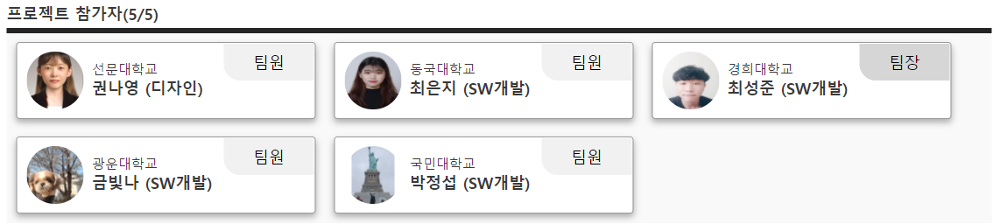

# Thanks For Today: 나를 알려주는 스마트한 일기장
당신에 대해 잘 알아갈 수 있는 스마트한 일기장

 

### 2021 SW중심대학 공동 해커톤

행사명: 2021 SW중심대학 공동 해커톤

일시: 2021.2.4(목) ~ 2.6(토)

[프로젝트Info](https://swhackathon.com/Team/Info/39)  
[발표영상](https://youtu.be/JZqDV9e2_E4)  
[시연영상](https://youtu.be/cevoZZ-MPNA)   

 

## 소개
당신은 자신을 잘 알고 있나요?   
당신의 소중한 일상을 기록하고 당신이 무엇을 좋아하는지, 어떤 사람인지 알아가 봅시다.   
당신을 더 잘 알아갈 수 있는 일기장 'Thanks For Today'

 

나를 알려주는 스마트한 일기장:    
당신에 대해 잘 알아갈 수 있는 스마트한 일기장, 하루를 마무리하는 사람들을 위한 정리 플랫폼

 

최근 코로나19로 인해 사회적 거리두기가 생겨나며 집에서 보내는 시간이 늘어나고 있습니다. 
이는 사회 활동이 줄어든다는 단점이 있지만, 이로 인해 자신에 대해 더욱 관심을 갖게 되어 자기계발에 집중하는 사람들이 늘어나고 있습니다.    
이에 따라 현재 자신의 일상을 기록하는 ‘일기’가 주목 받고 있습니다.  
코로나19로 인해 생긴 ‘코로나 블루’라는 현상 들어보셨을 것입니다.    
우울함은 자신의 실수에 대해 집착할 때 생겨나기 마련인데, 자신의 관점을 바꾸고 부정적인 악순환을 깨고 스스로 탈출 경로를 만들어야 합니다. 따라서 자신에 대해 자세히 아는 것이 중요합니다.  

  

저희의 서비스를 간략히 소개해드리겠습니다.

1. 해당 날짜 클릭시 간추린 본을 볼 수 있음
2. 일기 내용으로부터 주요 문장과 핵심 키워드들을 알려주는 기능   
3. 자신의 취향을 파악할 수 있도록 전체 일기 내용을 분석하여 Word Cloud 형태로 시각화  
4. 키워드 검색을 통해 특정 일을 언제 했는지 파악 가능     

 

## 서비스

 

## :computer: 기술 스택

### Natural Language Processing
Python - 'summa', 'hanspell', 'WordCloud', 'koNLPy-gRPC(커먼컴퓨터 API)'

### Front
React

### Backend
Python Django

### Web Design
Ps, Ai, Adobe Xd

[REST API 문서](https://github.com/seongjunChoi0714/ThanksForToday/blob/master/django-backend/README.md)

 

## :busts_in_silhouette:팀원

- 최성준([@seongjunChoi0714](https://github.com/seongjunChoi0714)) : 경희대학교(개발자, 팀장)  __NLP__

- 권나영 : 선문대학교(디자이너) __Web Design__

- 금빛나([@BitnaKeum](https://github.com/BitnaKeum)) : 광운대학교(개발자)  __NLP__

- 박정섭([@ParkJeongseop](https://github.com/ParkJeongseop)) : 국민대학교(개발자)  __Web back-end__

- 최은지([@choieunii](https://github.com/choieunii)) : 동국대학교(개발자)  __Web front-end__

